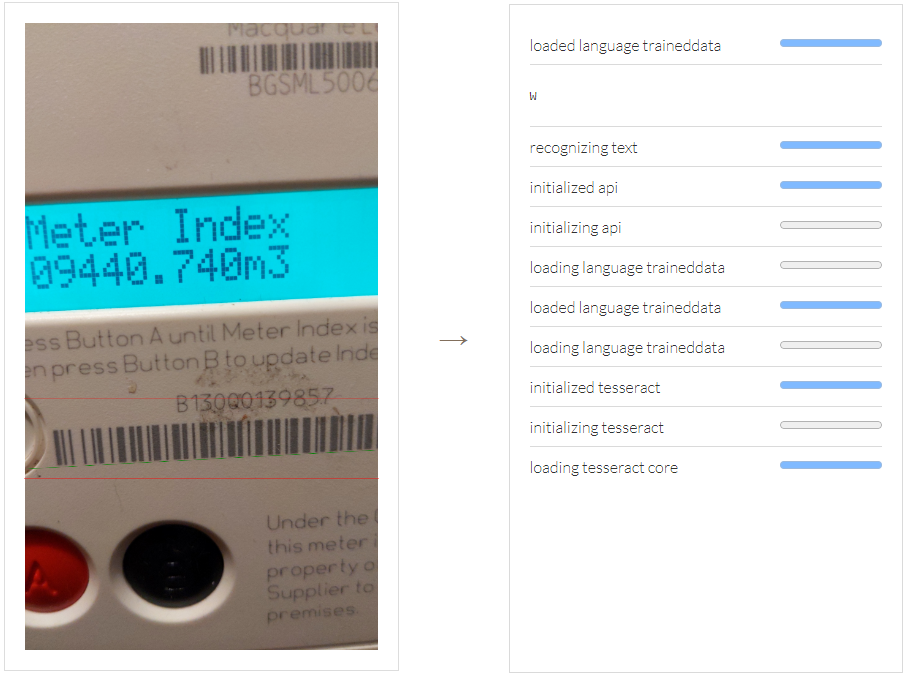
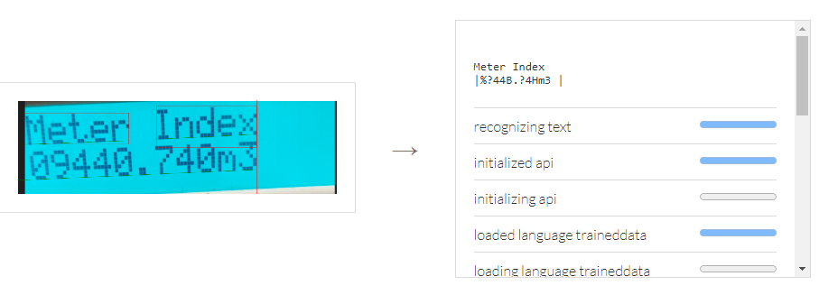
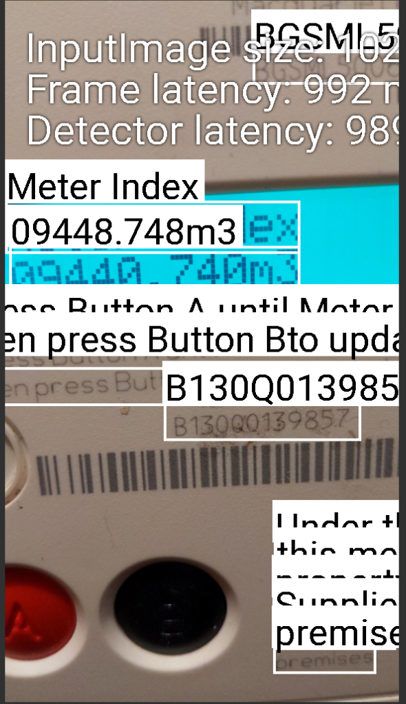
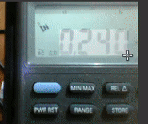

## Using OCR for Reading Energy Meters

A potential addition to the application is Optical Character Recognition (OCR). The purpose of this would be to enable meter readings to be read automatically from submitted images. During Sprint 1, the feasibility of this feature was investigated.

### Existing Solutions and Implementations

There are existing solutions for reading energy meters on the market, such as the EnergyCam by Fast Forward AG, which uses ‘a camera and OCR technology to take regular meter readings’ (FAST Forward AG 2015). Reading static images is also possible with software-based solutions, such as Tesseract, Google ML Kit and OpenCV. These utilise machine learning and are available as downloadable packages. Additionally, cloud-based image storage service Cloudinary also offers OCR capabilities.

Figure 1: Using the Tesseract.js port of the Tesseract OCR engine to read an energy meter. The reading is completely unusable, only extracting 'W' from the image.

Figure 2: Extracting just the display before using Tesseract.js produces better results than when using the raw image, however, the reading is still incorrect.

Figure 3: Reading an energy meter using the Google ML Kit. This performed better than Tesseract.js, however, two of the eleven characters in the meter reading are read incorrectly.

### Conclusion

As a result of this research, the project team determined that OCR was an unsuitable approach for data retrieval. Principally due to the numerous issues present in current OCR technology, for instance:

-   Accurately reading different types of energy meters (Digital/Analogue, 7-segment displays) would require different implementations (Sultana et al. 2022, p. 5)
-   Extracting the energy reading from surrounding text could be problematic
-   Some existing solutions require either specific camera positioning or the drawing of bounding-boxes around the display (see figure 2 and figure 4); this process could end up taking the user longer than entering the digits manually and does not guarantee success
-   A single mistake in the extracted data results in an unusable reading. Within the existing literature, accuracies have been reported at around 88% (Khunsamitpanya et al. 2021). It could therefore be expected that in the real-world and across all of the homes, erroneous readings would not be uncommon.

Figure 4: An existing JavaScript implementation for reading 7-segment displays utilises drawing a box around the display (Augusto 2021).

An option for future devlopment would be that once a sufficiently large dataset of meter readings and images has been collected by the agency, that this data could be used to train a machine learning model.

### References

Augusto, A. (2021), ‘7seg-ocr. [Online]’, https://github.com/arturaugusto/7seg-ocr/. Accessed: 3 February 2023.

FAST Forward AG (2015), ‘FAST EnergyCam 2.0. [Online]’, https://shop.marcomweb.it/images/stories/virtuemart/product/fast_energycam_2_folder.pdf. Accessed: 10 February 2023.

Khunsamitpanya, R., Yotsongpol, R., Srichanpliuw, S. & Techawatcharapaikul, C. (2021), The energy meter translation by optical character recognition technique, in ‘2021 9th International Electrical Engineering Congress (iEECON)’, pp. 412–415.

Sultana, U., Bilal, S., Naqvi, S. H. A. & Iqbal, R. (2022), ‘Smart ocr application
for meter reading’, Engineering Proceedings 20(1).
